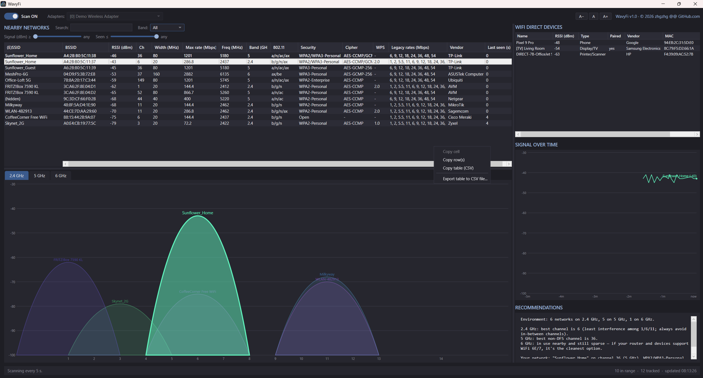

# WavyFi


> *Windows WiFi scanner that also sees WiFi Direct peers — phones, TVs, Miracast.*

WavyFi listens to the airwaves around a Windows machine and turns what it
hears into advice: which channel your own WiFi network should use, which
band is worth moving to, and which security settings need fixing. Along
the way it surfaces a layer most WiFi analyzers ignore entirely — the
**WiFi Direct** devices (phones, TVs, printers, Miracast receivers)
advertising peer-to-peer around you.



The channel-occupancy view takes its inspiration from inSSIDer, but
WavyFi goes its own way:

- **recommendation-first** — a congestion-scoring engine tells you what
  to *change*, not just what exists;
- **WiFi Direct discovery** side by side with infrastructure networks;
- **multi-adapter scanning** — several radios at once, one row per
  adapter, for comparing reception;
- **persistence of vision** — networks fade instead of blinking out;
  peers are kept for the whole session (their advertising is bursty);
- **a full CLI** (`scan` / `p2p` verbs) with filters, sorting and CSV
  for scripting — same engine, no window;
- C# / WPF with **zero third-party dependencies**.

## Features

- **Nearby networks** — SSID, signal (%, dBm), channel, frequency, band
  (2.4/5/6 GHz), security, BSSID, last-seen age. Your connected network is
  highlighted. Networks persist across scans: entries that drop out fade
  (stale) and are removed after 2 minutes. Auto-refreshes every 5 seconds
  via the Native WiFi API (`wlanapi.dll`).
- **Security detail** — auth (WPA2/WPA3...), cipher (AES-CCMP, TKIP...),
  WPS version parsed from the WPS information element ("-" when absent).
  Right-click the table header to choose visible columns.
- **Rates** — "Max rate" is the theoretical top PHY rate computed from the
  HT/VHT/HE capability elements (MCS ceiling × spatial streams × operating
  width × guard interval); "Legacy rates" lists the a/b/g compatibility
  rates from the beacon's Supported Rates elements (these cap at 54 Mbps
  by design — modern rates are advertised as MCS maps, not rate lists).
- **Vendor identification** — each BSSID (and WiFi Direct peer) is resolved
  to its manufacturer via an embedded IEEE OUI snapshot (see below).
- **Filtering** — search box (SSID/BSSID/vendor), band selector, minimum
  signal slider, and a last-seen slider (log scale, 5 s up to 168 h)
  that hides entries not seen recently enough; the tables and graphs
  all respect the active filters.
- **Signal over time** — select one or more network rows to plot their
  RSSI history as lines (5-minute sliding window, colors match the
  channel graphs). Selected WiFi Direct peers plot as dots: their
  readings arrive in sparse bursts, so dots show exactly what was
  measured instead of faking a continuous line.
- **Channel graphs** — inSSIDer-style occupancy curves per band
  (custom-drawn, no chart library): each network is a bell curve spanning
  its real bonded width (20 up to 320 MHz, from the HT/VHT/HE/EHT
  Operation elements), peaking at its RSSI, colored by BSSID, faded when stale.
  Selected table rows are emphasized. Channel 14 is placed at its true
  2484 MHz position.
- **WiFi Direct devices** — live discovery of advertising P2P peers
  (phones, TVs, Miracast receivers, printers) via `Windows.Devices.WiFiDirect`,
  shown in a compact sortable grid: name, RSSI (when reported), device type,
  pairing state, vendor, MAC, last seen. The search box and minimum-signal
  slider filter this grid too. Peers advertise in bursts, so they are kept
  for the whole session: stale ones fade and their age keeps counting.
- **Recommendations** — congestion-scored best channel for 2.4 GHz
  (among 1/6/11) and 5 GHz (non-DFS, with a DFS hint when quieter),
  overlap analysis for your own network, and security upgrade advice.

## Build, run, test

Requires the .NET 10 SDK on Windows 10 19041+.

```
dotnet build                     # whole solution
dotnet run --project src/WavyFi  # the GUI
dotnet test                      # unit tests (parser, rates, advisor, ...)
```

If the network list is empty, enable Location access in
*Windows Settings > Privacy & security > Location* — Windows gates
WiFi scan results behind it.

## CLI mode

Running the exe with any arguments scans from the terminal instead of
opening the window (output attaches to the parent console; redirection
and piping work):

```
WavyFi.exe scan [options]    scan for WiFi networks (default verb)
WavyFi.exe p2p  [options]    list advertising WiFi Direct peers
WavyFi.exe --demo            GUI with synthetic showcase data (the screenshot above)

  --adapters all|N[,M...]  (scan) adapters to use (default: the first one)
  --list-adapters          (scan) list adapters with their indexes and exit
  --band 2.4|5|6           (scan) only show this band
  --advise                 (scan) append channel recommendations
  --search TEXT            name/BSSID/MAC/vendor substring filter
  --min-signal DBM         hide entries weaker than this (e.g. -75)
  --csv                    CSV output instead of a table
  --sort COL[:asc|desc][,COL...]
                           sort by column(s), e.g. channel:asc,rssi:desc
  --watch [SECONDS]        keep scanning every SECONDS (default 5)
  --timeout SECONDS        max wait per sweep (default: 6 scan, 10 p2p)
  -v, --version            print the program version
  -h, --help               usage help
```

Examples: `WavyFi.exe scan --band 2.4 --min-signal -80 --advise`,
`WavyFi.exe scan --adapters all --csv > networks.csv`,
`WavyFi.exe p2p --sort type --watch 10`.

Note: the exe is a GUI-subsystem binary, so cmd/PowerShell print their
prompt without waiting for it; WavyFi nudges the shell to redraw the
prompt when the output is done (interactive consoles only — piped and
redirected output is untouched).

## Usage

- **Scanning toggle** — starts/stops the 5-second scan loop. Turning it
  on clears previously accumulated data (fresh session). While it's on,
  the adapter dropdown is locked; pause to switch adapters.
- **Adapters dropdown** — multi-select with checkboxes; defaults to the
  first adapter found. With several selected, every network appears once
  per adapter that hears it (compare reception between radios); the
  hidden "Adapter" column shows [index] + name, and graph labels carry
  the [index] suffix. Re-enumerated each time it opens, so USB adapters
  plugged in later appear; vanished adapters are dropped automatically.
- **Table** — click a row to select (plain click on a selected row
  unselects; empty space clears the selection). Selected networks are
  plotted in the signal-over-time graph and emphasized in the channel
  graphs. Right-click the header for the column chooser; hover a header
  for a description of the column. Right-click a cell for copy options
  (cell / rows / whole filtered table as CSV); Ctrl+C copies selected rows.
- **Filters** — search matches name, BSSID, and vendor; band and minimum
  signal narrow the table and graphs (recommendations always use all data).
- **Persistence** — networks that drop out of a scan fade (stale) and are
  removed after 2 minutes unseen; "Last seen" shows the age. WiFi Direct
  peers fade too but are kept for the whole session (their advertising is
  bursty, so absence rarely means the device left).
- **WiFi Direct grid** — sortable like the network table (RSSI sorts
  numerically); right-click a row for copy options; header right-click
  opens its own column chooser. Peers with no signal reading are hidden
  only while the minimum-signal slider is raised.

## Known limitations

- WiFi Direct discovery uses whatever radio Windows chooses for it, so
  peers cannot be attributed to a specific adapter.
- No monitor-mode capture — everything comes from standard scans, which
  is all the advice engine needs.
- Scan sweeps take the radio 2-5 s (DFS/6 GHz channels are listened to
  passively). The app refreshes as soon as the driver signals scan
  completion (`WlanRegisterNotification`), in addition to the 5 s timer.
- WiFi 7 (802.11be) is fully handled: widths (up to 320 MHz) from the EHT
  Operation element, max rates (MCS 12/13, 4096-QAM) from the EHT
  Capabilities MCS map.
- WiFi 8 (802.11bn) is not detected yet: the draft's element IDs are
  assigned in the IEEE ANA database, which is not publicly stable —
  hardcoding a guess could misparse other elements. A `bn` AP will show
  its WiFi 7 capabilities until the IDs are published (revisit once
  Wireshark's dissector carries them).
- "Your own network" grouping (excluding your router's other radios from
  congestion advice) uses a MAC heuristic — mesh nodes with unrelated
  MACs still count as neighbors.

## OUI vendor database

The Vendor column (and WiFi Direct device details) resolve MAC prefixes
against an embedded copy of the **Wireshark `manuf` file** — the IEEE
Registration Authority's OUI registry as curated and published by the
Wireshark project:

- Canonical source: <https://www.wireshark.org/download/automated/data/manuf>
- Credit: OUI data © IEEE Registration Authority; compiled and maintained
  by the Wireshark project. Upstream regenerates it weekly — per their
  request, do not fetch it more often than that.

The snapshot lives at `src/WavyFi.Core/Resources/manuf.gz` (embedded
resource, last updated 2026-07-21). To refresh it:

```sh
curl -sL https://www.wireshark.org/download/automated/data/manuf -o src/WavyFi.Core/Resources/manuf
gzip -9 -f src/WavyFi.Core/Resources/manuf   # produces manuf.gz
dotnet build                                 # re-embeds the resource
```

Only plain 24-bit OUI rows are used (the rarer /28 and /36 sub-allocations
are skipped). Locally administered MACs — randomized or virtual BSSIDs —
never appear in the registry and are shown as "(unknown vendor)".

## Layout

| Path | Purpose |
|---|---|
| `src/WavyFi.Core/` | The engine — no UI dependencies |
| `src/WavyFi.Core/Wlan/` | Native WiFi API bindings, scanner, beacon IE parser, PHY-rate math |
| `src/WavyFi.Core/WifiDirect/` | `DeviceWatcher`-based WiFi Direct peer discovery |
| `src/WavyFi.Core/Analysis/` | Channel congestion scoring and recommendation text |
| `src/WavyFi.Core/Models/` | Data models, persistent network/peer stores, formatters |
| `src/WavyFi.Core/Data/` | Loader for the embedded OUI (MAC prefix → vendor) database |
| `src/WavyFi/` | WPF front-end and the CLI mode |
| `src/WavyFi/Controls/` | Custom-drawn channel occupancy and signal-over-time graphs |
| `src/WavyFi/Cli/` | The `scan` / `p2p` console verbs |
| `src/WavyFi/Themes/` | The dark theme resource dictionary |
| `src/WavyFi/Settings/` | Registry persistence of window/columns/font preferences |
| `tests/WavyFi.Core.Tests/` | Unit tests (synthetic-beacon parser tests, rates, advisor, stores) |
| `tools/ScanTest/` | Console harness for live-testing the scanner without the UI |
| `tools/IconGen/` | Regenerates the icon: `dotnet run --project tools/IconGen -- src/WavyFi/Resources/WavyFi.ico` |

## License

MIT — see [LICENSE](LICENSE). The embedded OUI registry snapshot is
credited above.
